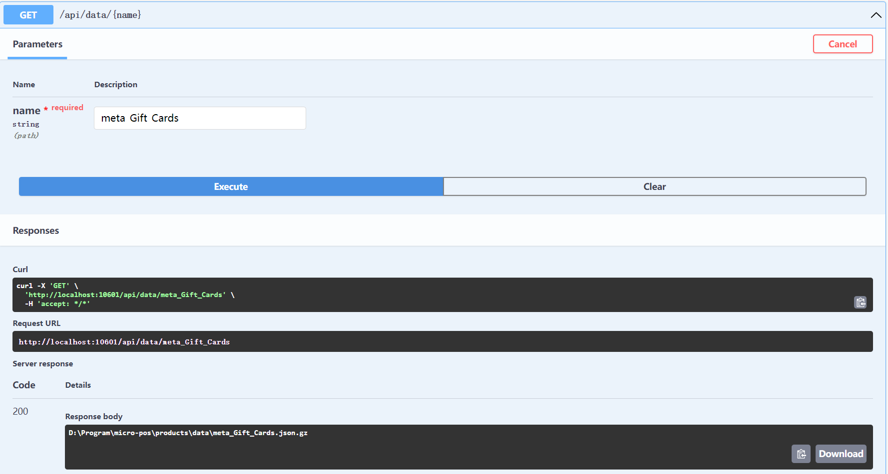
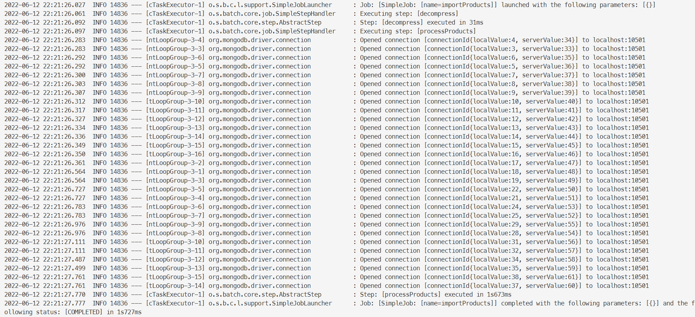
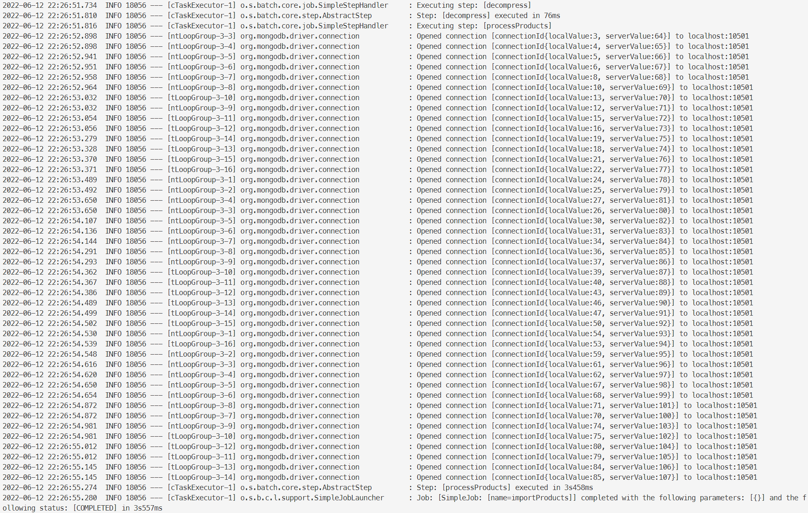
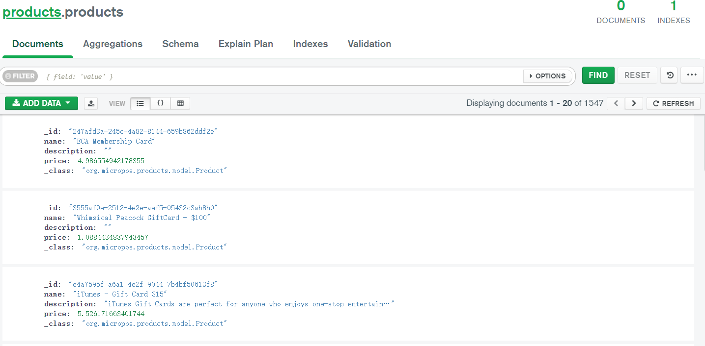
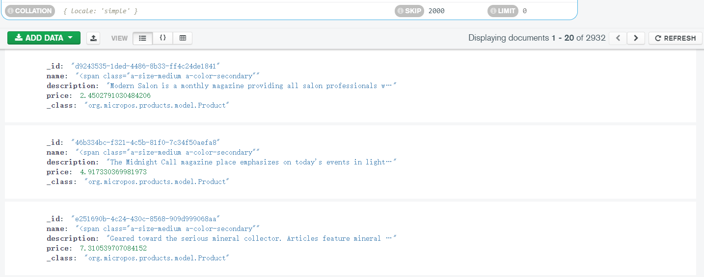
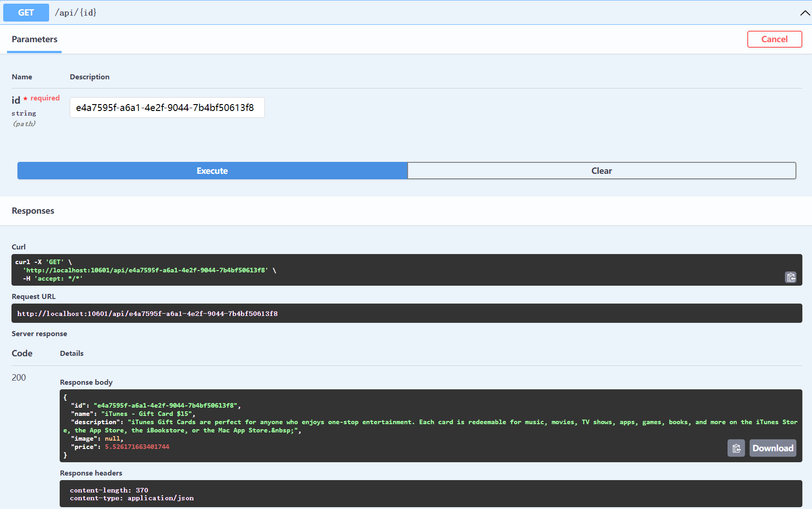

# aw06

实现了批量从 Amazon 数据集中导入产品信息，并集成到系统的 RESTful API，主要实现代码位于 [job](./products/src/main/java/org/micropos/products/job/) 目录。

> 此仓库版本为适用于此次作业的快照版本，原项目参见 [micro-pos](https://github.com/StardustDL/micro-pos)

## 任务设置

采用端到端批处理方式，输入为下载的 `.json.gz` 压缩包，输出写入单实例 MongoDB，具体步骤如下。

1. 解压缩
   1. 使用 GZipInputStream 实现 `.json.gz` 到 `.json` 的解压缩 Tasklet：`GzipDecompressTasklet`
2. 数据处理
   1. 使用 FlatFileItemReaderBuilder 使用 Jackson 的 ObjectMapper 定制实现 lineMapper，实现数据读取 `String` 到 `JsonNode`
   2. 检查读取到的 JsonNode 是否具有 Product 对应字段，进行文本过滤和清理，将 JsonNode 转换为 Product 对象
   3. 分块（100/chunk）实现批量写入，降低建立数据库连接的开销

## 任务执行

1. 使用 `SimpleAsyncTaskExecutor` 实现异步并行执行
2. 公开 `/data/{file_name}` 访问端口，传递文件名，在 Web Container 中启动对应的任务

## 效果

两个数据集为 meta_Gift_Cards 和 meta_Magazine_Subscriptions。

### 调用端口

### 日志输出

可观察到，由于分块批量处理，数据库连接数明显小于数据条数。

### 数据库结果

### API 查询数据

## Description

[Amazon Review Data (2018)](https://nijianmo.github.io/amazon/index.html) has a huge products metadata set of multiple categories.

|category| reviews | metadata |
|--| -- | -- |
|Amazon Fashion|reviews (883,636 reviews)|metadata (186,637 products)|
|All Beauty|reviews (371,345 reviews)|metadata (32,992 products)|
|Appliances|reviews (602,777 reviews)|metadata (30,459 products)|
| ... |
|Tools and Home Improvement|reviews (9,015,203 reviews)|metadata (571,982 products)|
Toys and Games|reviews (8,201,231 reviews)|metadata (634,414 products)|
Video Games|reviews (2,565,349 reviews)|metadata (84,893 products)|

Please finish the following tasks:

- Download no less than two categories of these metadata.
- Referring the example code in this repo, convert each line in the downloaded files into a POJO of `Product` class and save the object in a database like MySQL. 
- Integrate the database containing Amazon products with your own AW04 project and build an Amazon WebPOS system.

And, of course, always try to make the system run as fast as possible.